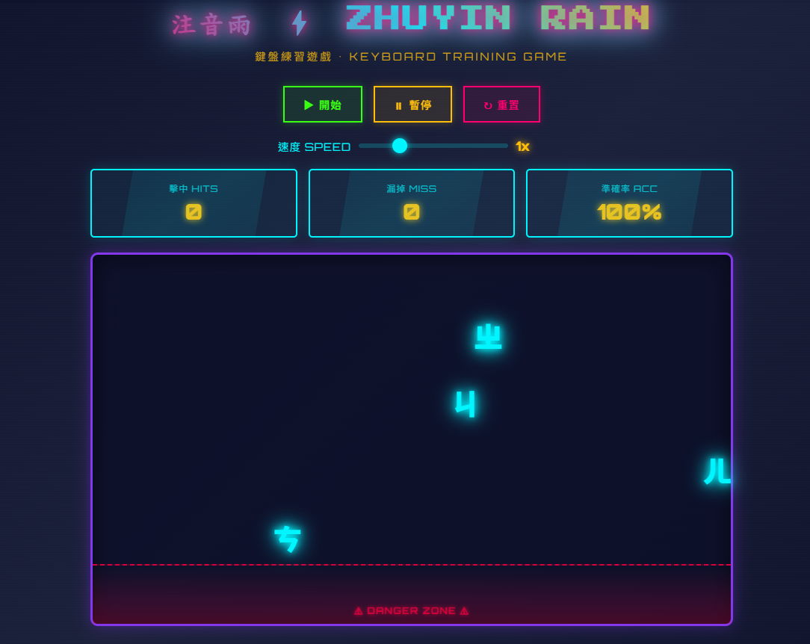

# 注音雨 ⚡ Zhuyin Rain

一個用來練習注音鍵盤的打字遊戲

[🎮 立即遊玩](https://mhbai.github.io/zhuyin-rain/)

---

## 📖 遊戲說明

注音符號會從上方掉落，按下對應的鍵盤按鍵來消除它們。不要讓符號掉到底部紅色危險區！

### 遊戲規則

- ✅ 按對應鍵盤按鍵消除注音
- ❌ 漏掉 10 個注音，遊戲結束
- ⚡ 每 20 個注音，速度自動增加 0.5 倍

---

## ✨ 功能特色

- 🎯 速度調整 (1x ~ 5x)
- 📊 即時統計：擊中數、漏掉數、準確率
- 📝 支援 37 個注音符號 + 4 個聲調
- 🎨 復古街機霓虹風格
- 📱 支援手機與電腦

---

## 🚀 如何部署到 GitHub Pages

1. 創建 GitHub Repository
2. 上傳 `index.html`（將 zhuyin_rain.html 重新命名）
3. 前往 Settings → Pages
4. Source 選擇 `main` branch → Save
5. 訪問 `https://你的用戶名.github.io/repository名稱/`

---

## 📄 授權

MIT License

---

## 🤖 關於開發

本遊戲由 [Claude](https://claude.ai) (Anthropic) 協助設計與開發

---

**Made with ❤️ and 🤖**

